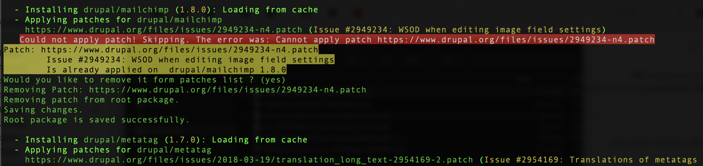
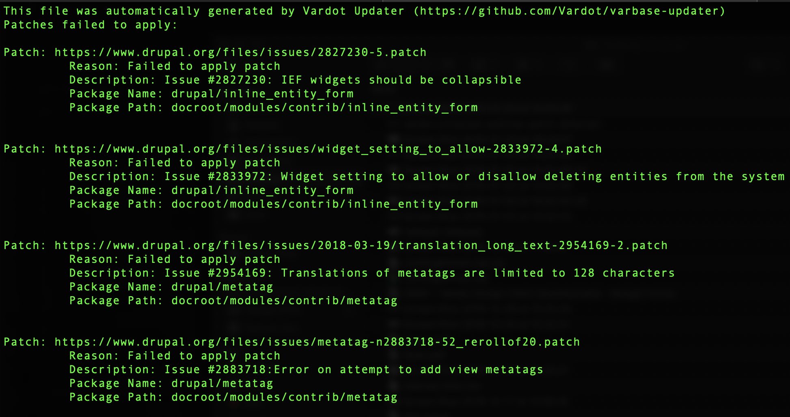

# Handling Patches When Updating

## Background

Most Drupal 8 distributions use a Composer patching package called [`"cweagans/composer-patches"`](https://github.com/cweagans/composer-patches). This package handles the patching mechanism nicely.

However, there are a number of problems we have had while maintaining Varbase and building sites on Varbase. Those problems are:

* There's no logging mechanism for failed patches
* Patches most of the times get included in new releases, there's no way this package can detect if the patch is already included in the new release

These issues become quite irritating and when maintaining a Drupal site, as Varbase and other Drupal distros rely on patches to work well.

Therefore, we have thought of a better way to handle patching \(it's now implemented in Varbase 8.6.3 and above\). You'll need to [update your Varbase version](https://docs.varbase.vardot.com/updating-varbase#the-update-process) to make use of this patching mechanism.


#### Now Varbase offers a forked and upgraded version of `composer-patches` package.

If you have [updated to Varbase 8.6.3 or newer](./#option-1-automated-process-using-varbase-updater-varbase-updater) it will be automatically included.  
Or see [installing Vardot's version of `composer-patches`](../getting-started/installing-varbase.md#installing-varbase-on-platform-sh) to add it manually.


## Patching Scenarios

When you execute `composer update` or `composer require vendor/xyz` command, newer versions of modules or core are downloaded. If patches for those modules are included, there are 3 possible scenarios:

| **Patch Applying Scenario** | **Patch is Still Needed?** | **Patch Will Apply?** | **Manual Action Needed?** |
| :--- | :---: | :---: | :--- |
| **1. Best Case:** Patch has not been included, and new version did not break the patch. | **Yes** | **Yes** | ✅**Nothing needed** |
| **2. Average Case:** Patch has been included in the new version. | **No** | **No** | ❌**You have to** remove the patch from `composer.json` |
| **3. Worst Case:** Patch has not been included, and new version did break the patch. | **Yes** | **No** | ❌**You have to** manually re-roll the patch, handle conflict, and fix it yourself |

### 

### How Vardot Will Handle Those Cases

Based on the scenarios mentioned above, we have forked the `"cweagans/composer-patches"` package, and added an Event Dispatcher on patch failure. The Event Dispatcher will dispatch an Event that will prompt you to perform an action depending on the scenarios above. Thus:


#### **Best Case:** Patch has not been included, and new version did not break the patch.

Nothing will happen.



#### **Average Case:** Patch has been included in the new version.

The Varbase Updater will detect that the patch has been applied and ask you if you want to remove it from your `composer.json` file.


Example screenshot below:


#### **Worst Case:** Patch has not been included, and new version did break the patch.

The Varbase Updater will log failed patches to a file named `failed-patches.txt`  
You can review it and try to handle those patches yourself.


Example screenshot below

## Installing Vardot's composer-patches Package

#### Varbase 8.6.3 or greater

If you're using Varbase 8.6.3 or greater, just run `composer update` and it will work.

#### Varbase 8.6.2 or older

If you're using Varbase 8.6.2 or older, you can [update to the most recent version of Varbase 8.6.x](https://docs.varbase.vardot.com/updating-varbase#the-update-process) and make use of this functionality. 

#### Use Vardot's composer-patches without updating Varbase _\(not recommended\)_

You can use Vardot's composer-patches without updating your Varbase installation by running the following commands:

1. From a command prompt window, navigate to your project:  `cd /path/to/YOUR_PROJECT`  
2. Require the Varbase Updater package. _\(Requiring the package only without running the update command will add the Composer plugins for patching but won't update Varbase. To update, you need to_ [_run the update command_](./#the-update-process)_\)._ `composer require vardot/varbase-updater`  
3. Add Vardot's composer-patches repository to use our forked package instead of the cweagans's.  `composer config repositories.composer-patches vcs https://github.com/vardot/composer-patches` 
4. Run `composer update` to get the new package. 
5. Run `composer update` again to update your packages and start applying the new patching mechanism.

