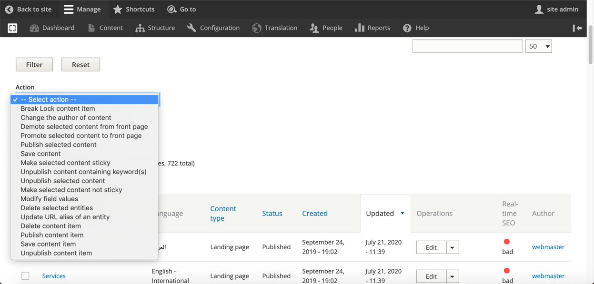

# Bulk Edit Content

## Bulk Actions

You are allowed to update nodes, delete, modify, save, publish and unpublish several nodes at the same time. 

You just need to select the nodes that you want to edit its items from, select 'Action' from the dropdown under the content page and click on 'Apply'. 

You'll then be presented with a form that contains fields that appear in at least one of the selected nodes. You just need to populate the values as desired \(or leave blank if you don't want to change a field\) and submit.


Be careful when you select multiple pages and want to delete them this action cannot be undone.


