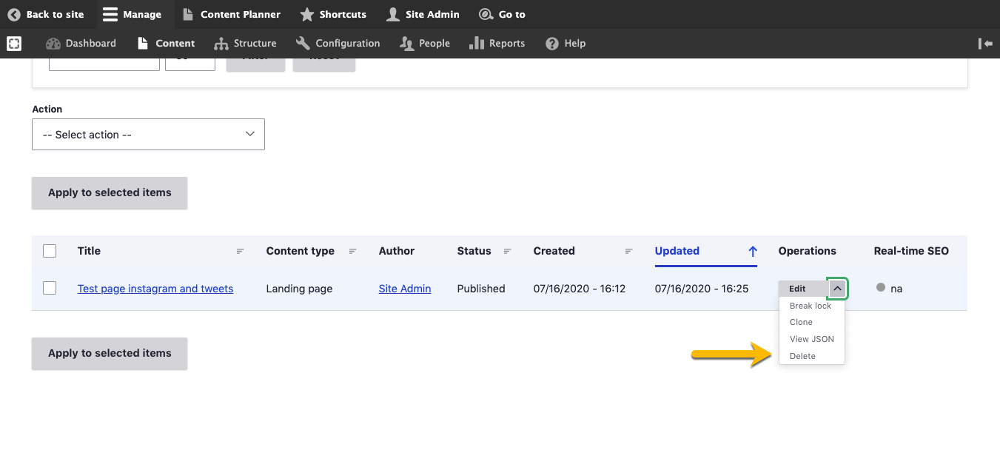

# Delete Content

Varbase can let you delete your content, users, blocks, views, etc. So be careful when you delete a section you might mess up your page.


Any user who has "**Delete**" permissions can view _Delete_ link.


If you have permission you can see "Delete" link in the edit menu


Be careful when you delete a page as you can't retrieve it back unless you have back up for the content. 


