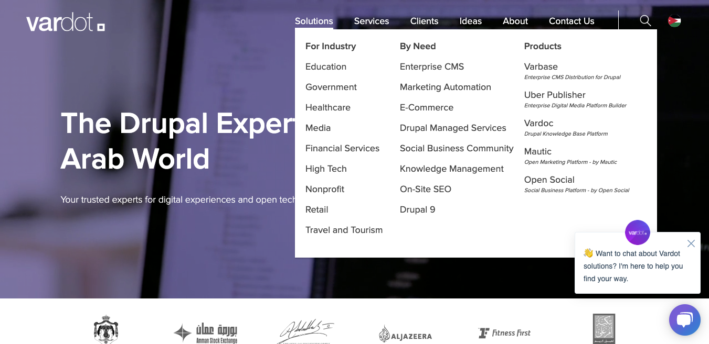

# Modify Content

## How to edit pages in Varbase

To edit pages in Varbase you do not need to be technical if you have some experience with a text editor you will find it simple.

On other hand, almost everything can be editable from text, images to menu header, and footer section. It depends on how the site is built. 

