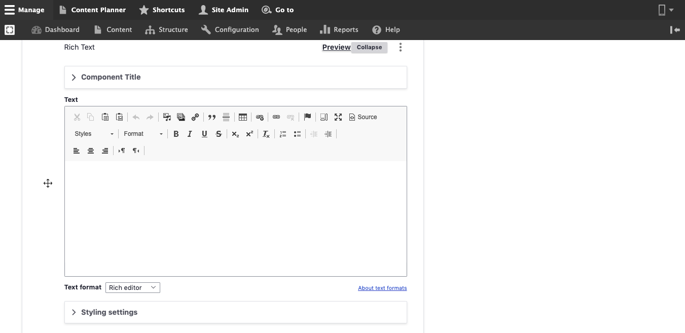

# Create Content

## **Adding Content**

Users can add content to the site with predefined content types throughout the site.


**Before you begin**: Make sure you are logged in as a user who has the right to create content – ask your system administrator if you are not sure; otherwise, some of the fields you need to select will not be visible.


## Rich-Text Editor “WYSIWYG”

The rich text editor or the WYSIWYG (What You See Is What You Get) allows you to format the text inside the site as needed. Admins can also upload images, add links, and much more. The table below displays the tools along with the action it provides.&#x20;

## In This Section:

1. [Add Basic Page](add-a-basic-page.md)
2. [Add landing page](add-a-landing-page.md)
3. [Add Blog](add-blog.md)
4. [Add Media](add-media/)
