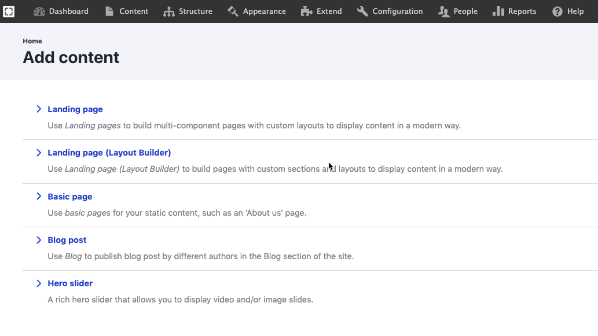

# Create Content

## **Adding Content**

Users can add content to the site with the predefined content types throughout the site.


**Before you begin**: Make sure you are logged in as a user who has the right to create content – ask your system administrator if you are not sure; otherwise, some of the fields you need to select will not be visible.


## In This Section:

1. [Add Basic Page](add-a-basic-page.md)
2. [Add landing page](add-a-landing-page.md)
3. [Add Blog](add-blog.md)
4. [Add Media](add-media/)

