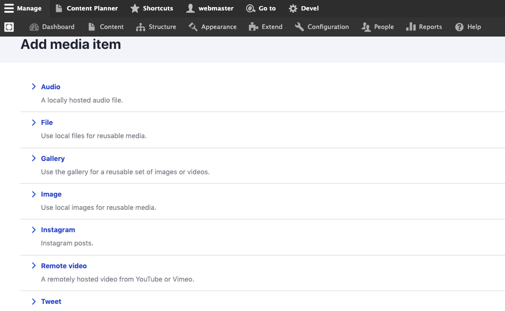

# Add Media

## Create a Media:

Follow these steps to create a new _Media_ to your website:

1. Select _Media_ from the _Manage_ administrative menu**.**
2. Select _Add media._
3. Select type of the Media that you need to add.

## In this section:

1. [Audio](audio.md)
2. [File](file.md)
3. [Gallery](gallery.md)
4. [Image](image.md)
5. [Instagram](instagram.md)
6. [Remote video ](remote-video.md)
7. [Tweet](tweet.md)
8. [Video](video.md)

