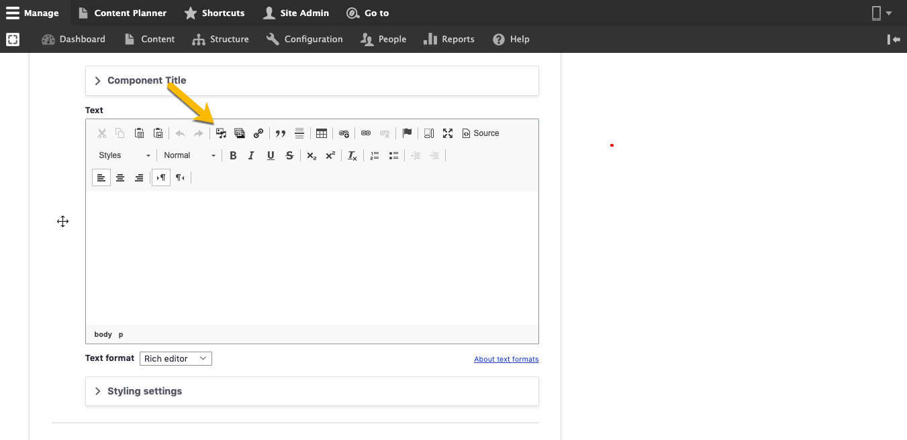

# Add Media

## Media in Varbase:

Varbase _Media_ fields are variant, you can easily add images, Gallery, video, files, and other several types.\
\
&#x20;You can add _Media_ from several places in your website: &#x20;

### 1- Media node page

1. Select _Media_ from the _Manage_ administrative menu**.**
2. Select_ Add media._
3. Select type of the Media that you need to add.

### 2- Media field

You can add _Media_ upon clicking the _Media_ button in the content type.

\[Add snapshot]

### 3- WYSIWYG

Any time you can add media from the WYSIWYG in Rich text editor. \


**Note:** You can edit or delete any _Media_ file from the Media library page.&#x20;


## In this section:

1. [Image](image.md)
2. [Remote video ](remote-video.md)
3. [Video](video.md)

