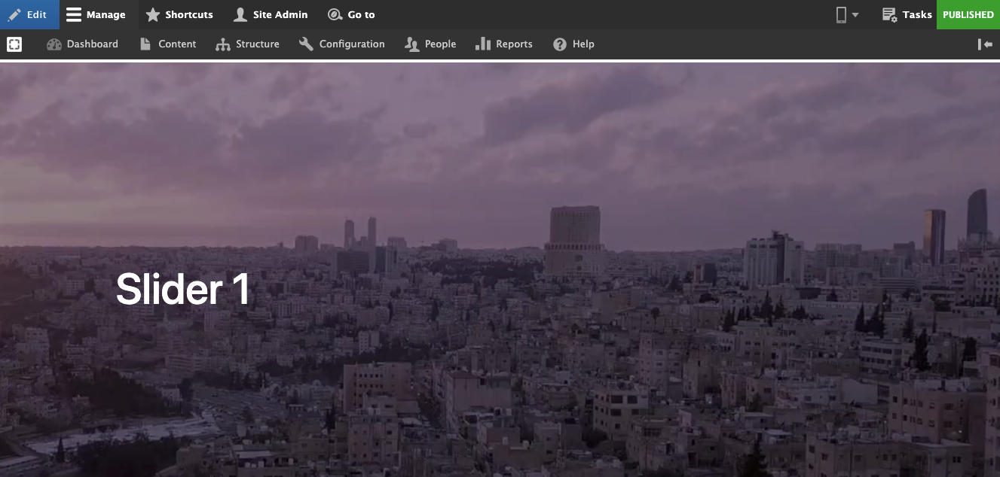

# Video

## Add New Video 

In Varbase you can add a video from several places: 

1. From the media page, you are able to add a video file in the media library.
2. File field.
3. WYSIWYG

### Required file types \(Default\):

* mp4
* webm
* ogv

