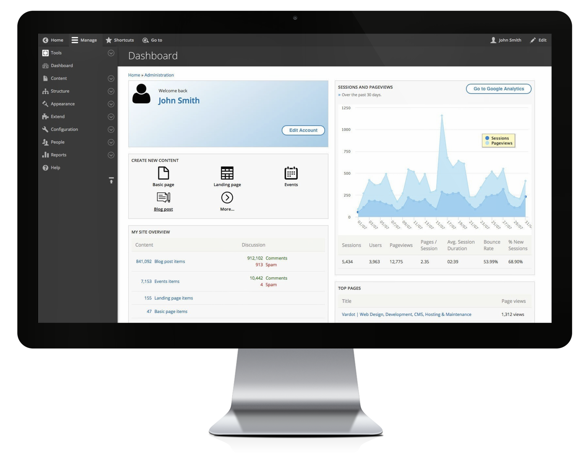

# Dashboard

This dashboard is built on top of [Total Control Admin Dashboard](https://www.drupal.org/project/total_control) module, utilizing Panels, [Google Analytics Reports](https://www.drupal.org/project/google_analytics_reports), and several enhanced blocks and widgets for an intuitive and flexible administration experience.  

> The idea is made to provide the site admins with an appealing and concise dashboard to become the home of any Drupal site's administration task.

### How to edit a Dashboard

Coming soon!

