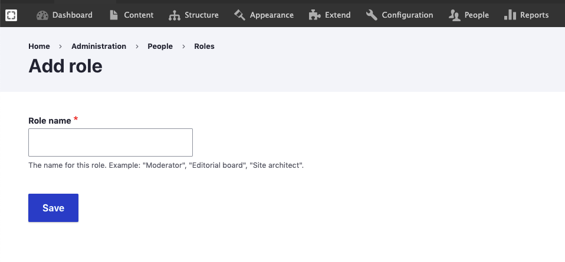

# Create Roles

To create a new role follow these steps:


Note: Only **webmaster** can add new roles. 


1. In the _Manage_ administrative menu, navigate to _People&gt;Roles._
2. Click _Add role_ to add a custom role.
3. Enter the _Role_ name __that you want.
4. Check the new role under the _Roles_ tab.

You can now edit the permissions for this new Role.

