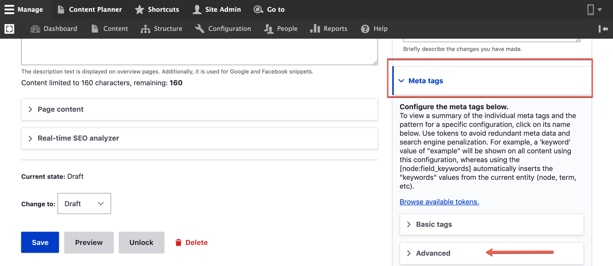
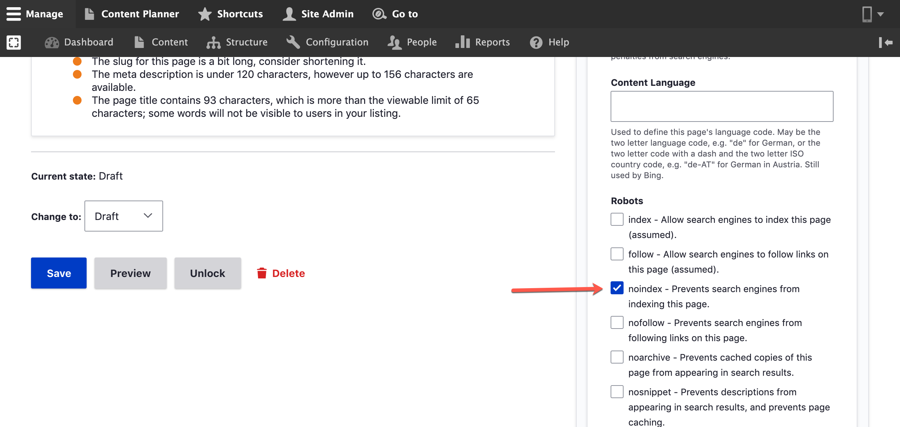
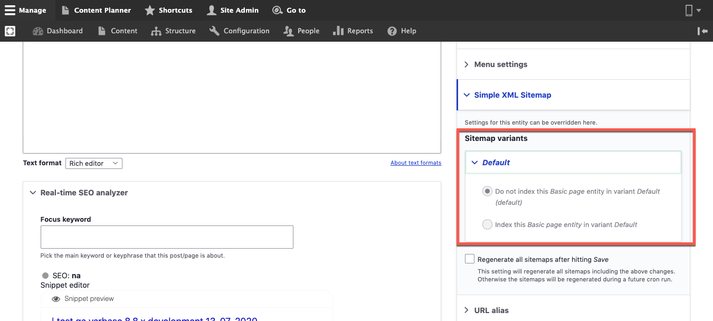

# Prevent a Single Content From Being Indexed

This article will walk you through how to exclude a specific piece of content from being indexed in search engines. To achieve this, you'll need to:

1. Set `noindex` value for `robots` meta tag when adding or editing the content
2. Prevent the content from being added to the XML sitemap

So let's see below how we can achieve this:

### 1. Set `noindex` value for `robots` meta tag when adding or editing the content

1. Navigate to any content for example filter the content page with Basic page
2. Edit a certain basic page
3. From the right hand side look for “Meta tags” section.

4\. Open _Meta tags_ section and scroll down into the "Advanced" tab.\
5\. Look for "Robots" title, and check on "noindex - Prevents search engines from indexing this page."

####

### 2. Prevent the content from being added to the XML sitemap

Setting the `noindex` value for `robots` meta tag will prevent search engines from indexing the page. However, the page can still be included in the XML sitemap. This means that you risk getting an error "**Indexed, though blocked by robots.txt**" from the search engine console (.i.e Google Search Console).

To prevent/fix this warning from happening, you'll need to exclude this page from your site's XML sitemap.

1. Navigate to any content for example filter the content page with Basic page
2. Edit a the content you want to exclude from XML sitemap
3. Look for “**Simple XML Sitemap**” and click the item that can be located in the sidebar

&#x20;4\. You will be seeing two options, “Do not index this basic page” or by default, it is selected “Index this”

5\. To exclude this page from being indexed please select “**Do not index this Basic page entity in variant Default**”
